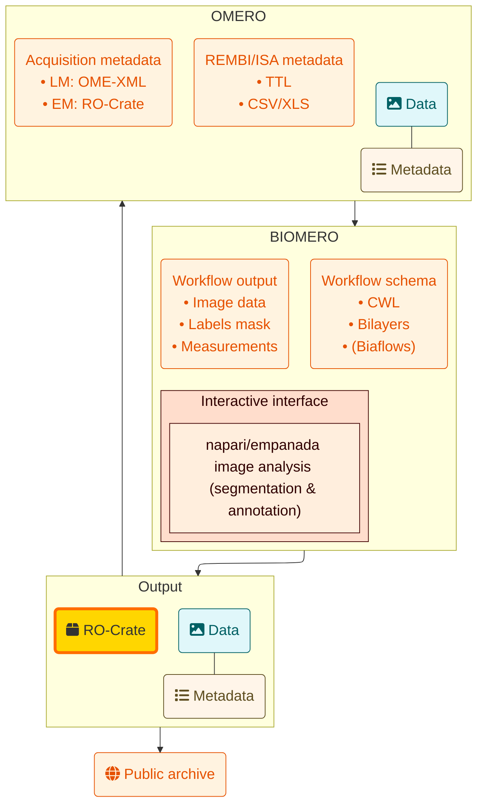

# Integrated FAIR workflow metadata in BIOMERO

## Joost de FolterA, Pascal de BoerG, Ben GiepmansG, Ron HoebeA, Przemek KrawczykA, Torec LuikA, Maarten PaulL, Eric ReitsA, Lennard VoortmanL, Katy WolstencroftA
### A Amsterdam UMC, G UMC Groningen, L Leiden UMC

*Intro*: Effective microscopy data management is crucial for keeping complex imaging datasets reproducible, interoperable, and reusable across workflows.

*Problem*: While REMBI (Recommended Metadata for Biological Images) metadata standards and OMERO advance FAIR data practices, gaps persist between acquisition and analysis due to fragmented metadata and limited support across microscopy types, hindering integration and reproducibility.

*Objective*: FAIR (Findable, Accessible, Interoperable and Reusable) approaches are essential for reproducibility, scalable analysis, and meeting publication and funding requirements, while also enabling cross-disciplinary data reuse, including integration with x-omics. We build on BIOMERO 2.0, which transforms OMERO into a FAIR-compliant, provenance-aware bioimaging platform.

*Solution*: Building on BIOMERO 2.0, this work introduces a FAIR workflow metadata layer linking data, analysis, and provenance into a machine-readable format, improving reproducibility, transparency, and workflow integration while reducing metadata burden.
By providing standardised metadata, this facilitates compatibility for key public image archives such as BioImage Archive.
Standardised metadata supports integration with leading public image repositories such as the BioImage Archive.

*Research Object Crate (RO-Crate)*: RO-Crate is a community effort to establish a lightweight approach to packaging research data with their metadata.

[researchobject.org/ro-crate](https://researchobject.org/ro-crate)

*BioImage Archive* is a free, publicly available online resource which stores and distributes biological images.

[ebi.ac.uk/bioimage-archive](https://ebi.ac.uk/bioimage-archive)

*Empanada* is a tool for panoptic segmentation of organelles in 2D and 3D.

[empanada.readthedocs.io](https://empanada.readthedocs.io)

Zenodo record for this poster: https://zenodo.org/records/20919503
