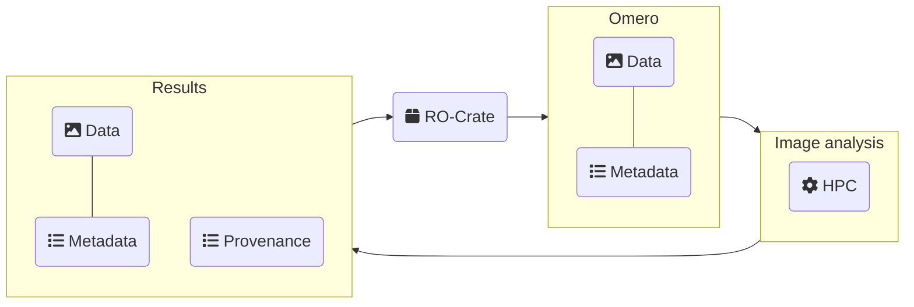

# Integrated FAIR workflow metadata in BIOMERO

## Joost de Folter, Pascal de Boer, Ben Giepmans, Ron Hoebe, Przemek Krawczyk, Torec Luik, Maarten Paul, Eric Reits, Lennard Voortman, Katy Wolstencroft

Effective data management in microscopy is essential to ensure that increasingly complex imaging datasets remain reproducible, interoperable, and reusable across acquisition, analysis, and sharing workflows.

Due to REMBI (Recommended Metadata for Biological Images) and OMERO (Open Microscopy Environment Remote Objects), we have made steps forward in FAIR (findable, accessible, interoperable, and reusable) data management, but gaps remain between acquisition and analysis. A key challenge is the fragmentation of metadata across acquisition and analysis workflows, combined with limited support metadata for different types of microscopy. This makes integration complex and time-consuming, reducing reproducibility, data reuse, and compliance with growing publication and funding requirements.

FAIR approaches are therefore essential to ensure reproducibility of imaging experiments, support scalable data analysis, and meet increasing publication and funder requirements. In addition, FAIR metadata facilitates cross-disciplinary reuse of data, including integration with broader research domains such as x-omics.

We build on BIOMERO 2.0, which transforms OMERO into a FAIR-compliant, provenance-aware bioimaging platform. BIOMERO integrates data import, preprocessing, analysis, and workflow monitoring through an OMERO.web plugin and containerized components. These integrated layers enhance FAIRification, supporting traceable, reusable workflows for image analysis that bridge the gap between data import, analysis, and sharing.

This work establishes a FAIR workflow metadata layer that connects image data, analysis steps, software environments, parameters, and provenance into a coherent machine-readable workflow description. The resulting RO-Crate-based representation supports reproducible analysis, improves transparency of computational workflows, and reduces the manual burden of metadata management. Additionally, we adopt Bilayers as a generic workflow schema, as it supports the container-based image analysis workflows used by BIOMERO while maintaining a limited scope that simplifies implementation and support. By focusing on workflow metadata rather than general platform description, this approach strengthens BIOMERO as a bridge between image data management and FAIR, reusable bioimage analysis, with potential extension to additional imaging modalities and cross-domain integration with omics workflows.

[github.com/NL-BioImaging](https://github.com/NL-BioImaging/)

